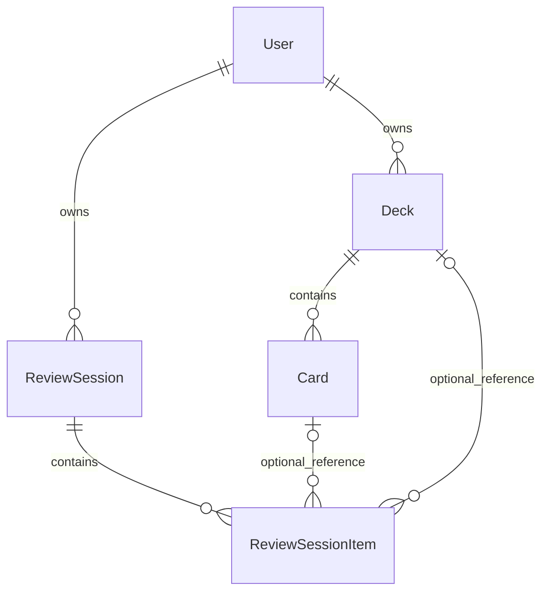

# Mnemo — фактическое текущее состояние проекта

## 0. Snapshot

| Параметр | На момент анализа |
| --- | --- |
| Дата | 8 сентября 2026, часовой пояс среды Asia/Yekaterinburg |
| Проект | Mnemo; техническое `name` в `package.json` — `Nuxt-3` |
| Рабочая директория | `D:/projects/mnemo` |
| Git branch | `main` |
| HEAD | `cfe6bd5867454303ad71133e0bf45e70ca92a8b0` |
| Исходное состояние git | `git status --short` пуст: отслеживаемых изменений перед аудитом нет |
| Node в среде | `v22.22.0`; требование `engines` в package.json отсутствует |
| Package manager | pnpm: `pnpm-lock.yaml`, `pnpm-workspace.yaml`, commit перехода `4ca2e01`; установлен pnpm `11.17.0`. Поле `packageManager` отсутствует; одновременно сохранён `package-lock.json` |
| Nuxt | manifest `^4.3.0`; pnpm lock и установленный пакет `4.5.1` |
| Vue | manifest `^3.5.27`; lock и установленный пакет `3.5.40` |
| Prisma / @prisma/client | manifest `^7.3.0`; lock и установленные пакеты `7.9.1` |
| Pinia | `3.0.4`, модуль `@pinia/nuxt` `^0.11.3` |
| Auth | `@sidebase/nuxt-auth`: manifest `^1.2.0`, установлен `1.3.1`; `next-auth` строго `4.21.1`; `bcryptjs` `^3.0.3` |
| Markdown | `md-editor-v3` `6.5.6` |
| UI | `vuetify-nuxt-module`: manifest `^1.0.0-alpha.3`, lock `1.0.0-rc.3`; peer Vuetify в lock `4.1.6`, пакет по корневому `node_modules/vuetify` — `4.0.1`. Локальное дерево и lock не полностью совпадают |
| Прочее | `pg`, `@prisma/adapter-pg`, Vue Router, Tailwind, SCSS, VueUse, dayjs-nuxt; подробнее §2 |

### Метод и границы достоверности

Основной источник — текущие файлы `app/`, `server/`, `shared/`, `prisma/schema.prisma` и все четыре миграции. Просмотрены конфигурация, все страницы, компоненты, API, сервисы, utils, composables, store, типы, зависимости и README. Выполнен поиск всех заданных ключевых слов, `$fetch`, `defineStore`, TODO/FIXME/TO-DO, persistence и тестовых файлов. Применимых `AGENTS.md` в проверенных родительских директориях и дереве проекта не обнаружено.

Дополнительно проверены локальные декларации и реализация `md-editor-v3`, результаты auto-import в существующей `.nuxt`, а также компиляция двух Markdown SFC через установленный `vue/compiler-sfc` **в памяти**. Компиляция подтвердила некорректное имя модели `defineModel("")`; изолированный Vue renderer в памяти подтвердил, что editor всё же получает и возвращает `modelValue` через автоматический fallthrough attributes. Поэтому отказ сохранения back не заявляется. Генерируемые файлы использованы только как дополнительное свидетельство, а не вместо исходников.

Это аудит реализации, а не протокол успешного browser/E2E-прогона. Приложение, build, миграции и запросы, изменяющие БД, не запускались; зависимости не переустанавливались. Применены ли миграции к конкретной БД, как настроен production и проходит ли чистая сборка: **Не удалось определить по текущему коду.** Формулировка «реализовано» ниже означает наличие связанного рабочего пути по анализу кода с отдельно перечисленными дефектами, а не подтверждённое production-тестирование.

Просмотренные релевантные commits: `cfe6bd5` (07.09: результаты, Markdown, новые маршруты), `3b8251f` (25.08: сокращение store, серверное состояние), `4619e5b` (19.08: session models), `8fafc7e` (04.08: фиксация ответа). Содержание текущих файлов проверено независимо от сообщений commits.

**Главный результат:** серверная сессия уже реализована; утверждение «пока только подготовка к review» устарело. Но основной сценарий сейчас нельзя считать завершённым: сломана передача Markdown-содержимого, нет загрузки session на странице обучения после reload, отсутствует часть ownership-проверок и защита от конкурентных ответов.

## 1. Product Overview

Mnemo — приложение для личных колод карточек и интервального повторения. Реальная единица знаний — `Card.front` (вопрос/название) и `Card.back` (ответ). Пользователь открывает обратную сторону и сам оценивает воспоминание одним из трёх ответов. Проверки текста ответа, AI-оценки и объективной правильности нет.

Код отражает регистрацию/вход, личные колоды, создание/редактирование/удаление карточек, серверный расчёт знания карточки и прогресса колоды, дневной preview, общую сессию по нескольким колодам и результаты. Основная продуктовая идея из `README.md` подтверждена моделями, `app/pages/index.vue`, `app/components/card/card-form.vue` и review endpoints.

### Реальный пользовательский путь сейчас

```text
/login: переключение на регистрацию
→ POST /api/internal/auth/register
→ форма входа (автоматического входа после регистрации нет)
→ signIn('credentials')
→ /: колоды + preview
→ /decks/new → сохранение → /
→ /decks/:deckId/cards
→ /decks/:deckId/cards/new или /:cardId/edit
  [editor связан с формой через неявный Vue fallthrough, §13]
→ /: «Начать повторение» при ненулевом preview
→ POST /api/review-session → session в Pinia
→ /learn-session/:sessionId
  [ОБРЫВ: ответ не передаётся корректно в MdPreview]
→ самооценка → серверное обновление Card + Item + Session
→ следующий неотвеченный item
→ /final-session/:sessionId → «На главную»
→ следующий визит: новая due-выборка по сохранённому dueAt
  [ОБРЫВ: прямой reload страницы обучения не восстанавливает session]
```

Backend review и переходы между items присутствуют. Дефект отображения ответа делает этот путь неполноценным для реального изучения; ошибку объявления модели editor маскирует Vue fallthrough (§13). Поиск представлен полями без поиска. Число «5 дней» на главной — константа в шаблоне, не достижение пользователя.

## 2. Technology Stack

| Область | Установлено/объявлено | Фактическое использование |
| --- | --- | --- |
| Frontend | Nuxt 4, Vue 3, TypeScript, vue-router | SFC Composition API, file-based pages, `navigateTo`, `useRoute`, `ref`, `computed`, lifecycle hooks |
| Backend | Nitro/H3 через Nuxt | `server/api`, `defineEventHandler`, `readBody`, `getRouterParam`, `createError` |
| Database | PostgreSQL, `pg` | Prisma с `PrismaPg` в `server/utils/db.ts`; `docker/docker-compose.yml` поднимает только PostgreSQL |
| ORM | Prisma CLI, client, adapter-pg | Чтение/CRUD/interactive transaction. Adapter находится в devDependencies, хотя импортируется runtime-кодом |
| Auth | sidebase/nuxt-auth, next-auth, bcryptjs | Credentials provider, JWT/session callbacks, `useAuth`, `getServerSession`, bcrypt hash/compare |
| State | Pinia, @pinia/nuxt | Один setup-store `mnemo-session`; breadcrumbs отдельно через Nuxt `useState` |
| UI | Vuetify module, Tailwind module, sass | `v-btn`, `v-text-field`, `v-menu`, `v-icon`, grid/flex utilities, собственные SCSS-обёртки |
| Editor | md-editor-v3 | `MdEditor`, `MdPreview`, stylesheet; preview сломан, editor связан через fallthrough, §13 |
| Dates | dayjs-nuxt объявлен и подключён | В доменной логике реально используются native `Date`, `setDate`, `setHours`, `Intl.DateTimeFormat`; вызовов Day.js не найдено |
| VueUse | @vueuse/core, @vueuse/nuxt подключены | Явных продуктовых вызовов VueUse не найдено; `useState` здесь Nuxt |
| Images | @nuxt/image подключён | `NuxtImg` не найден; используются `img`, `v-img`, CSS background |
| Storage | nuxt-file-storage подключён | Upload endpoints, callbacks загрузки и вызовы file storage не найдены |
| Fonts | @nuxtjs/google-fonts | Roboto и Montserrat в `nuxt.config.ts`; глобальный Roboto в SCSS |
| Typed routing | nuxt-typed-router | Подключён; именованные routes в страницах/формах |
| Validation | Vuetify rules + ручные `if` | Нет общей схемы валидации; TypeScript generic у `readBody` не валидирует вход |
| Tooling | dotenv, prettier, tsx | dotenv импортируется `prisma.config.ts`; scripts prettier/tsx не объявлены |
| Другие dependencies | @openai/codex, Windows OXC bindings | Продуктовых импортов нет. Codex dependency не является AI-функцией Mnemo; bindings — платформенные зависимости инструментов |
| Testing | Нет прямого test framework и test script | Проектные тесты не найдены (§20) |

В `nuxt.config.ts` `@pinia/nuxt` указан дважды. `devtools.enabled = true`. `compatibilityDate = '2025-07-15'` не является версией Nuxt. `package.json` содержит только build/dev/generate/preview/postinstall (`nuxt prepare`); lint/typecheck/test scripts отсутствуют. `tsconfig.json` расширяет `.nuxt/tsconfig.json`, задаёт aliases и исключает `prisma/generated`.

## 3. Project Architecture

```text
app/
  app.vue
  assets/{icons,images,scss}/
  layouts/default.vue
  middleware/auth.global.ts
  pages/
    index.vue, login.vue
    decks/new.vue
    decks/[deckId]/edit.vue
    decks/[deckId]/cards/{index,new}.vue
    decks/[deckId]/cards/[cardId]/edit.vue
    learn-session/[sessionId]/index.vue
    final-session/[sessionId]/index.vue
  components/
    auth/{login-form,register-form}/ui/
    breadcrumbs/, card/, decks/, header/
    form/{mnemo-form-learn,mnemo-form-final-session}/
    ui/editor/
    widgets/mnemo-repeat-form/
  entities/
    cards/api/, decks/api/
    login/{api,lib,types}/
    review-session/{api,model}/
  composables/{use-breadcrumbs,use-date-time}.ts
  types/ui/button.ts
server/
  api/{auth,internal/auth,user,decks,review-session,review-sessions}/
  service/
    card.service.ts, deck.service.ts
    review/calculate-{next-review,interval-days,easy-factor,knowledge-score}.ts
  utils/{db,date-helper,server-session}.ts
shared/
  const.ts
  types/{card,deck,user,session,breadcrumbs,index}.ts
prisma/
  schema.prisma
  migrations/ (4 SQL migrations + migration_lock.toml)
  generated/ (устаревший отдельно сохранённый client)
lib/prisma.ts (альтернативный неиспользуемый client)
docker/docker-compose.yml
```

`app/stores/`, отдельного repository-слоя, отдельного session service, очереди задач или отдельного backend-приложения нет. `entities` группирует client API и review store, но это не сквозной доменный слой: session orchestration находится непосредственно в endpoints. Компоненты форм сами запрашивают и сохраняют данные. Pages задают route params и связывают виджеты.

Фактические пути данных:

```text
Главная → getDecks() → $fetch GET /api/decks
        → Prisma SELECT → calculatePercentForDeck() → DTO → tiles

CardForm → createCard/updateCard → $fetch → endpoint → Prisma → PostgreSQL

MnemoRepeatForm → useMnemoSessionStore.loadPreview/startSession
               → entities/review-session/api → endpoint → Prisma
               → interleaveDeckCards (при start) → сохранённые session/items

LearnPage → store.completeCurrentCard → reviewSessionCard
          → answer endpoint → calculateNextReview → Prisma transaction
          → Card + ReviewSessionItem + ReviewSession → новый store state

FinalPage → getReviewSessionById → GET endpoint → Prisma → page refs → ResultsForm
```

Прикладная логика дат и прогресса выполняется на сервере; выбор текущего item и отображение — на клиенте. Для CRUD Pinia не используется. Основная загрузка страниц выполняется `onMounted`, а не SSR `useAsyncData`.

## 4. Domain Model

Источник всех таблиц ниже — `prisma/schema.prisma`. `?` означает nullable. У перечисленных полей без указанного default его нет. Все PK уникальны. DateTime в миграциях представлены `TIMESTAMP(3)`, а не колонками с отдельным пользовательским timezone.

### User

| Поле | Тип | Default / ограничение |
| --- | --- | --- |
| id | Int | PK, autoincrement() |
| login | String? | unique |
| email | String | unique |
| name | String? | — |
| passwordHash | String? | колонка `password_hash` |
| createdAt | DateTime | now() |
| decks | Deck[] | обратная relation |
| reviewSessions | ReviewSession[] | обратная relation |

Локальная регистрация заполняет login, name, hash и синтетический email; nullable hash допускает пользователей без credentials, но другой provider не реализован.

### Deck

| Поле | Тип | Default / ограничение |
| --- | --- | --- |
| id | String | PK, cuid() |
| userId | Int | FK User.id |
| title | String | — |
| description, icon, color | String? каждое | — |
| isPublic | Boolean | false |
| isArchived | Boolean | false |
| createdAt | DateTime | now() |
| updatedAt | DateTime | @updatedAt |
| user | User | userId; onDelete Cascade |
| cards | Card[] | обратная relation |
| reviewSessionItems | ReviewSessionItem[] | обратная relation |

Индексы: `[userId]`, `[isPublic]`, `[isArchived]`. Удаление User удаляет его Deck; удаление Deck удаляет его Cards.

### Card

| Поле | Тип | Default / ограничение |
| --- | --- | --- |
| id | String | PK, cuid() |
| deckId | String | FK Deck.id |
| front, back | String каждое | — |
| status | CardStatus | NEW |
| dueAt | DateTime | now() |
| lastReviewedAt | DateTime? | — |
| intervalDays | Int | 0 |
| easeFactor | Float | 2.5 |
| repetitions | Int | 0 |
| lapses | Int | 0 |
| createdAt | DateTime | now() |
| updatedAt | DateTime | @updatedAt |
| deck | Deck | deckId; onDelete Cascade |
| reviewSessionItems | ReviewSessionItem[] | обратная relation |

Индексы: `[deckId]`, `[status]`, `[dueAt]`. Enum `CardStatus`: `NEW`, `LEARNING`, `REVIEW`. Полей knowledgeScore, difficulty, stability, learning steps нет.

### ReviewSession

| Поле | Тип | Default / ограничение |
| --- | --- | --- |
| id | String | PK, cuid() |
| userId | Int | FK User.id |
| totalCards | Int | размер снимка при создании |
| completedCount | Int | 0 |
| hardCount, normalCount, easyCount | Int каждое | 0 |
| status | ReviewSessionStatus | IN_PROGRESS |
| startedAt | DateTime | now() |
| completedAt | DateTime? | — |
| items | ReviewSessionItem[] | обратная relation |
| user | User | userId; onDelete Cascade |

Индексы: `[userId, status]`, `[userId, startedAt]`. Enum: `IN_PROGRESS`, `COMPLETED`, `ABANDONED`. Уникального ограничения «одна IN_PROGRESS на пользователя» нет; `ABANDONED` нигде не записывается прикладной логикой. Нет отдельного `updatedAt`.

### ReviewSessionItem

| Поле | Тип | Default / ограничение |
| --- | --- | --- |
| id | String | PK, cuid() |
| sessionId | String | FK ReviewSession.id |
| cardId | String? | FK Card.id |
| deckId | String? | FK Deck.id |
| position | Int | позиция снимка очереди, с 0 |
| answer | ReviewAnswer? | HARD / NORMAL / EASY |
| answeredAt | DateTime? | — |
| cardFront, cardBack, deckTitle | String каждое | текстовые snapshots |
| session | ReviewSession | onDelete Cascade |
| card | Card? | onDelete SetNull |
| deck | Deck? | onDelete SetNull |

Unique: `[sessionId, position]`. Индексы: `[cardId]`, `[deckId]`. Unique `[sessionId, cardId]` отсутствует. Snapshot сохраняется после удаления исходной карточки/колоды; nullable FK не позволяет успешно ответить на такой item текущим endpoint.

### ER-модель



Отдельных моделей `ReviewSessionState`, `ReviewHistory`, Auth Session/Account нет. История ответов частично представлена сохранёнными items и агрегатами session; прежние/новые SRS-параметры в историю не записываются. Прямой card-review endpoint вообще не создаёт history.

### Миграции и расхождения

| Миграция | Содержание |
| --- | --- |
| `prisma/migrations/20260205112529_init/migration.sql` | User с integer id, email/name/createdAt |
| `prisma/migrations/20260516054828_add_decks_and_cards/migration.sql` | Deck, Card, CardStatus, индексы/FK |
| `prisma/migrations/20260516120000_reconcile_user_auth_fields/migration.sql` | login, password_hash, unique login |
| `prisma/migrations/20260817144117_add_review_sessions/migration.sql` | ReviewSession, ReviewSessionItem, два enum, индексы, Cascade/SetNull |

Эта цепочка соответствует текущей основной schema по изученным полям. `cuid()` и `@updatedAt` управляются Prisma и не обязаны выглядеть как SQL defaults. `prisma/generated/schema.prisma` ей **не соответствует**: там только User с UUID, другой nullable email и обязательным hash, старый output generator. Приложение импортирует `@prisma/client`, а не этот каталог. Состояние реально применённых миграций не проверялось.

## 5. Card / SRS Model

| Поле Card | Кто изменяет | Где читается | Участие в due-выборке |
| --- | --- | --- | --- |
| status | default NEW; `calculateNextReview` через оба review endpoints | knowledge score, DTO списка | Нет фильтра по status |
| dueAt | default now; `calculateNextReview.addDays` | preview/start, сортировка; deck due count; `formatReviewDate` | **Основной критерий** |
| lastReviewedAt | review algorithm = now | хранится, возвращается raw Card | Нет |
| intervalDays | review algorithm | следующий интервал, knowledge | Косвенно через dueAt |
| easeFactor | review algorithm | следующий интервал, следующий ease | Косвенно |
| repetitions | review algorithm | первая/последующая попытка, knowledge | Косвенно |
| lapses | review algorithm | knowledge и следующий lapses | Нет прямого фильтра |

Состояние хранится в Card, не в Pinia как независимая SRS-модель. Изменение front/back в PUT не сбрасывает SRS. Нет отдельного endpoint ручной установки dueAt или сброса прогресса. Основные writers: `server/api/review-sessions/[sessionId]/items/[itemId]/answer.post.ts` и legacy `server/api/decks/[deckId]/cards/[cardId]/review.post.ts`.

## 6. Review Algorithm

Вся логика находится в `server/service/review/`. Это собственный простой алгоритм интервалов; реализации полноценного SM-2/FSRS или импорта соответствующей библиотеки нет.

`shared/types/card.ts` определяет `ANSWER.HARD`, `NORMAL`, `EASY`. В review UI это соответственно «Повторить», «Трудно», «Легко»; в results — «Не вспомнил», «Сложно», «Легко».

Обозначения: `I` — прежний intervalDays; `R` — прежний repetitions; `E` — прежний easeFactor; `L` — прежний lapses.

| Изменение | HARD | NORMAL | EASY |
| --- | --- | --- | --- |
| status | LEARNING | REVIEW | REVIEW |
| easeFactor | clamp(E − 0.2, 1.3, 3.5) | clamp(E, 1.3, 3.5) | clamp(E + 0.15, 1.3, 3.5) |
| intervalDays при R=0 | 1 | 1 | 3 |
| intervalDays при R>0 | 1 | max(1, round(I × E)) | max(3, round(I × (E + 0.3))) |
| repetitions | 0 | R + 1 | R + 1 |
| lapses | L + 1 | L | L |
| lastReviewedAt | now | now | now |
| dueAt | now + intervalDays календарных дней | то же | то же |

`calculateNextReview` сначала получает новое ease через `calculateEaseFactor`, но в `calculateIntervalDays` передаёт **старое** `card.easeFactor`. Это существенная деталь формулы. «Первая попытка» определяется `currentRepetitions === 0`, а не status NEW; после HARD следующая успешная попытка снова использует первый интервал. HARD не возвращает item в текущую очередь: это ответ на сегодня с due завтра. Каждый HARD, в том числе для новой карточки, увеличивает lifetime lapses; уменьшения lapses нет.

`addDays` клонирует now и вызывает `setDate(getDate() + days)`. Время суток сохраняется; это не явное прибавление `days * 24h` и не округление к полуночи. Новая карточка с `(I=0,E=2.5,R=0,L=0)` после NORMAL имеет `(I=1,E=2.5,R=1,L=0,status=REVIEW)`; после следующего NORMAL интервал `round(1*2.5)=3`. После первого EASY интервал 3 и ease 2.65; после второго EASY интервал `round(3*(2.65+0.3))=9`. Это примеры вычисления по исходникам, не существующие project tests.

### Due semantics

В preview и start идентичный предикат:

```ts
const endOfToday = startOfTomorrow()
// только свои неархивные колоды
cards: { where: { dueAt: { lt: endOfToday } }, orderBy: { dueAt: 'asc' }, take: 10 }
```

`server/utils/date-helper.ts`: копия текущего Date → `setDate(+1)` → `setHours(0,0,0,0)`. Включаются просроченные карточки и все карточки до конца текущего календарного дня, даже если их точное время сегодня ещё не наступило. Ровно следующая полночь исключается. Нижней границы нет; NEW тоже входят благодаря default dueAt=now. День определяется **локальной timezone процесса сервера**; настройки timezone пользователя, явного UTC/dayjs timezone и пользовательского календаря нет. Timezone production: **Не удалось определить по текущему коду.**

Есть расхождение: `calculatePercentForDeck` считает `dueCardsCount` как `card.dueAt <= new Date()`, то есть точное наступление времени. Эта цифра на deck tile может быть меньше дневного preview; preview дополнительно ограничен 10 карточками на колоду, deck count не ограничен. `GET /api/decks/:deckId` вообще не выбирает dueAt для расчёта и потому отдаёт 0 dueCardsCount (сравнение undefined с Date ложно). `formatReviewDate` на клиенте использует начало дня в timezone браузера, не сервера.

## 7. Review Session

### 7.1 Session Preview

Реализован `GET /api/review-session/preview` (`server/api/review-session/preview/index.get.ts`). `getSessionUserId` обязателен. Выбираются все свои неархивные колоды, из каждой максимум 10 due items по условиям §6; колоды без выбранных карточек удаляются из результата.

DTO `IReviewSessionPreview` / `IReviewSessionPreviewDeck` в `shared/types/session.ts`:

```ts
{
  totalCards: number,               // сумма уже ограниченных cardsCount
  estimatedMinutes: number,         // 0 при total=0, иначе ceil(total*20/60)
  decks: [{ deckId, title, cardsCount }]
}
```

Константы `SESSION_CARDS_PER_DECK_LIMIT=10`, `AVERAGE_CARD_REVIEW_SECONDS=20` — `shared/const.ts`; функция времени — `calculateEstimatedSessionMinutes`. Общего лимита всей сессии нет. Preview не создаёт session и не показывает оставшиеся items существующей активной session: это новая выборка по текущим Cards. Список самих вопросов в preview не возвращается.

### 7.2 Session Start

`app/components/widgets/mnemo-repeat-form/index.vue::startRepeat` → `store.startSession()` → `createReviewSession()` → `POST /api/review-session`. После ответа `activeSession = result.session`, затем переход по имени `learn-session-sessionId`.

Endpoint выполняет последовательно:

1. Авторизация, выбор текущих due-карточек как для preview, с front/back/title.
2. `interleaveDeckCards(nonEmptyDecks)` формирует полную очередь.
3. При пустой очереди — 409 «Нет доступных к изучению карточек».
4. Только **после проверки пустоты** поиск самой новой своей session `IN_PROGRESS`.
5. Если найдена — возвращается существующая session с items. Иначе nested create сохраняет ReviewSession и все ReviewSessionItems.

То есть session **не только frontend state**. Очередь заранее записывается в PostgreSQL; повторный start обычно возвращает старую активную сессию. Но поиск/create не защищены общей транзакцией/unique constraint от двух одновременных start. Проверка пустой новой очереди может помешать возвращению уже существующей активной session.

Response: `{ startedAt: new Date().toISOString(), totalCards: session.totalCards, decks: текущая due-сводка, session }`. При reuse внешние startedAt/decks не описывают исходную session; внутренние `session.startedAt/items` корректнее. Frontend использует именно `session`. `IReviewSession` ожидает в `decks` поле `id`, а сервер возвращает `deckId`.

### 7.3 Session State

| Состояние | Хранение и поля | Создание / восстановление / удаление |
| --- | --- | --- |
| ReviewSession | БД: id/userId, totals/counters/status/timestamps | POST create или reuse; GET по id; при завершении сохраняется; отдельного delete нет; Cascade при удалении User |
| ReviewSessionItem[] | БД: position, nullable references, snapshot, answer/answeredAt | nested create; GET/POST/answer возвращают отсортированные items; остаются после completion; Cascade при удалении Session |
| activeSession | Pinia ref: `ISession \| null` | null при создании store; устанавливается start и каждым answer; load-by-id action и reset отсутствуют |
| preview | Pinia ref | null → loadPreview на mount виджета; остаётся в памяти до новой загрузки/уничтожения контекста |
| inverted | ref в `mnemo-form-learn/index.vue` | false при mount; true при открытии back; переключается сразу после emit ответа |
| Results data | page refs session/easyItems/normalItems/hardItems/totalCards | `onMounted` GET по route id → `prepareData`; не помещаются в activeSession |
| Auth session | Auth.js cookie/JWT, useAuth | credentials flow; не хранит review queue |

Собственного localStorage/sessionStorage/persist plugin или review cookie нет. `IReviewSessionStateType` с queue/decks/counters существует только как тип старой клиентской структуры. Отдельной Prisma-модели state нет.

### 7.4 Queue

`server/service/deck.service.ts::interleaveDeckCards` обходит `cardIndex` от 0 до максимальной длины колоды, внутри — каждую колоду. Например, A=[a1,a2,a3], B=[b1,b2] дают `[a1,b1,a2,b2,a3]`. Порядок колод запросом не задан; при равном dueAt tie-break карточек тоже не задан. Это чередование колод, не глобальная сортировка всей очереди по dueAt и не random shuffle.

Item: `{cardId, deckId, cardFront, cardBack, deckTitle, position}` плюс DB id/sessionId/answer/answeredAt. `position` начинается с 0; все responses сортируют `items` по `position asc`. `currentCard` — первый item без `answeredAt`. `currentCardIndex` не существует. `completedCount` берётся из session; отдельного remaining computed нет, логически остаток — items с answeredAt=null. При согласованном состоянии их число равно `totalCards - completedCount`. HARD тоже завершает item; повторного помещения в очередь нет.

### 7.5 Answer

```text
BackForm button → emit('click', ANSWER)
→ MnemoFormLearn.onClick → emit + немедленный flip на front
→ LearnPage.onClick → completeCurrentCard(answer) (без await/catch)
→ reviewSessionCard(card.sessionId, card.id, answer)
→ POST /api/review-sessions/:sessionId/items/:itemId/answer
→ getSessionUserId
→ prisma.$transaction:
    findFirst Item: id + sessionId + answeredAt=null
                   + session.userId + status=IN_PROGRESS
    отсутствует Item → 404; отсутствует Card → 409
    calculateNextReview(item.card, body.answer)
    tx.card.update(SRS)
    tx.reviewSessionItem.update(answer, answeredAt)
    tx.reviewSession.update(counters, status, completedAt), include items
→ {sessionId,itemId,session,sessionCompleted}
→ store.activeSession = result.session
→ currentCard вычисляется заново
→ при COMPLETED navigateTo('/final-session/:id')
```

**Card обновляется сразу после каждого ответа**, в одной транзакции с item и session, а не при завершении всей сессии. Текст вопроса/ответа берётся из snapshot item, а SRS — из актуальной Card. Сервер не проверяет, что item самый первый неотвеченный: владелец может ответить на любой неотвеченный item своей IN_PROGRESS session.

Последовательный повтор одного уже принятого ответа получает 404 и не обновляет Card. Но конкурентные запросы могут оба прочесть unanswered item до обновления: запись item затем выполняется только по id, без условия answeredAt=null; блокировок/serializable/retry нет. Counters записываются как прочитанное значение +1, не атомарным increment. Поэтому транзакция обеспечивает совместный commit трёх сущностей, но не доказывает однократность ответа (§19).

Нет проверки допустимых `body.answer`, обязательности body/route params в этом endpoint. Нет loading/isSubmitting/disabled у клиента. При network error форма уже перевёрнута, сообщение/recovery отсутствуют; при потере ответа после успешного commit клиент остаётся со старым item, а повтор получает 404.

### 7.6 Resume / Reload

| Сценарий | Фактическое поведение |
| --- | --- |
| Start с главной → SPA learn page | store уже содержит session, currentCard выбирается из items |
| Reload `/learn-session/:id` | store создаётся с null; page не читает route id и не вызывает GET. Пустой вопрос, total=0; ответ при currentCard=null просто return |
| Прямой `/learn-session/:id` в новой вкладке | То же; backend session есть, но загрузка не подключена |
| Переход на другой sessionId при уже заполненном store | Page использует прежний store независимо от URL; может показывать/отправлять ответы старой session |
| Возврат на главную → снова start | POST может вернуть последнюю IN_PROGRESS и тем самым восстановить первый неотвеченный item; только при непустой текущей due-очереди и видимой кнопке |
| Reload `/final-session/:id` | Page сама GET-ит session по id, считает группы; данные результатов не требуют предыдущего start. Но guard компонента читает пустой store и лишь логирует |
| Прямые `/review`, `/results` | Таких страниц/redirects нет; для авторизованного пользователя — отсутствующий route, для неавторизованного middleware направляет на login |
| Прямой results для IN_PROGRESS | GET не ограничивает статус, page показывает «Сессия завершена» с частичными группами |
| Неизвестный/чужой id results | GET возвращает `{}` вместо 404; `session.value?.items.filter` падает на отсутствующем items, поскольку optional chaining стоит только на session |

`GET /api/review-session/:id` существует и фильтрует `userId + id`, возвращает session любого статуса с items. Вызов найден **на results page**, но не на learn page и не в store. Автоматического восстановления текущей карточки на reload нет. При повторном start последовательно сохранённые ответы не выбираются повторно; конкурентные запросы, несколько sessions и потеря HTTP-response остаются отдельными рисками.

### 7.7 Completion

Backend: `nextCompletedCount = item.session.completedCount + 1`; `sessionCompleted = nextCompletedCount >= totalCards`; status COMPLETED и completedAt=now, иначе IN_PROGRESS и completedAt=null. Завершённая session и items остаются в БД. Отдельного finish endpoint нет.

Store `isCompleted` сравнивает status с `REVIEW_SESSION_STATUS.COMPLETED`. Action делает redirect по `result.session.status`, а не по возвращённому `sessionCompleted`; `isCompleted` не нужен для самого redirect. При загрузке learn page существующей завершённой session redirect не реализован. Store не очищается после completion/возврата домой/logout.

### 7.8 Session Results

`app/pages/final-session/[sessionId]/index.vue` загружает серверную session, `prepareData()` фильтрует `items` по `ANSWER`. `app/components/form/mnemo-form-final-session/index.vue` показывает:

| Метрика | Реальная реализация |
| --- | --- |
| Общее количество | `session.totalCards` |
| Легко | число items с EASY |
| Сложно | число items с NORMAL |
| Не вспомнил | число items с HARD |
| hardCount/normalCount/easyCount | Сохраняются backend, но экран пересчитывает длины массивов и не читает эти counters |
| accuracy | Нет в текущем прикладном коде, DTO и UI |
| duration | Нет вычисления/отображения; startedAt/completedAt хранятся |
| progress | На review back есть progress; на results отсутствует |
| Детали карточек/колод | Нет отображения, хотя массивы items загружены |

Кнопка «На главную» работает через `navigateTo('/')`. Проверка completion в компоненте — только console.log, без UI guard. Начальная отрисовка до GET уже показывает завершение и нулевые результаты; loading/error state отсутствует.

## 8. Pinia / Client State

Найден ровно один `defineStore`: `useMnemoSessionStore`, id `mnemo-session`, `app/entities/review-session/model/mnemo-repeat-store.ts`. `app/stores` отсутствует.

```ts
// фактические writable refs
{
  preview: IReviewSessionPreview | null,
  activeSession: ISession | null
}
// activeSession по серверному содержимому:
{
  id, userId, totalCards, completedCount,
  hardCount, normalCount, easyCount,
  status, startedAt, completedAt,
  items: [{ id, sessionId, cardId, deckId, position,
            answer, answeredAt, cardFront, cardBack, deckTitle }]
}
```

| Computed/action | Смысл / API |
| --- | --- |
| currentCard | первый `!item.answeredAt`, иначе null |
| totalCards, completedCount | поля session или 0 |
| progressPercent | 0 если total=0; иначе round(completed/total*100) |
| isCompleted | status === COMPLETED |
| loadPreview | getPreviewSession → GET preview → preview |
| startSession | createReviewSession → POST start → activeSession |
| completeCurrentCard | current item → reviewSessionCard → POST answer → replace activeSession → redirect при completion |

Очередь больше не дублируется в отдельных refs, локальных инкрементов counters нет. Backend — источник сохранённого состояния; Pinia — копия полного ответа. Однако backend persistence **не подключён как hydration на learn page**. Стандартная интеграция Pinia/Nuxt присутствует, но server-side загрузки session в store и собственной восстановления из storage нет. Client-only start state reload не переживает.

`useBreadcrumbs` (`app/composables/use-breadcrumbs.ts`) использует `useState('breadcrumbs', [])`; actions: setBreadcrumbs, clearBreadcrumbs, setLastBreadcrumbs, внутренние setToForLastCrumb/setLastCrumb. Это не Pinia. Forms и pages также содержат локальные refs: decks, cards, search, form, auth fields, loading/error, inverted, results. Persist этих данных отсутствует. Отсутствие reset store при смене аккаунта может оставлять в памяти содержимое предыдущего пользователя; server answer проверяет владельца и отвергнет такой запрос.

## 9. API

Ниже все **19 текущих route-файлов** в `server/api`, включая один Auth.js catch-all. Пути файлов соответствуют структуре endpoints: `[deckId]`, `[cardId]`, `[sessionId]`, `[itemId]` заменяют `:param`; index-файлы дают корневой route каталога. `Auth: да` означает явный `getSessionUserId`, кроме делегированного Auth.js. `internal` в URL не делает endpoint закрытым.

### Auth

| Method | Endpoint | Auth | Ownership | Request | Response | Используется frontend |
| --- | --- | --- | --- | --- | --- | --- |
| GET/POST, делегирование | `/api/auth/*` | Auth.js protocol | callbacks привязывают token.id/session.user.id | Credentials и служебные Auth.js запросы | Auth.js session/CSRF/providers/callback/signout | Да: useAuth/signIn/signOut; файл `server/api/auth/[...].ts` |
| POST | `/api/internal/auth/register` | Нет, публичная регистрация | создаёт нового User | login/password/repeatPassword | `{id,name}` | Да: `entities/login/api/api.ts::register` |
| POST | `/api/internal/auth/login` | Нет, проверяет credentials | lookup по login + bcrypt | login/password | `{id,name,email}` либо null | Косвенно: authorize Auth.js делает server `$fetch` |

Register: trim login, обязательность полей, равенство паролей, длина ≥6, проверка существования login; 400/409. Runtime-проверки типов строк нет, race unique-create не преобразуется в 409. Login: пустые/неверные credentials → null; отсутствует rate limit. `authorize` не содержит своего catch ошибки внутреннего `$fetch`. Catch-all не раскрыт как самописные десятки endpoints: методы/подмаршруты реализованы зависимостью Auth.js, локальный файл не задаёт индивидуальные handlers.

### Deck

| Method | Endpoint | Auth | Ownership | Request | Response | Используется frontend |
| --- | --- | --- | --- | --- | --- | --- |
| GET | `/api/decks` | Да | `where.userId` | — | вычисленные `IDeck[]` | getDecks, home |
| POST | `/api/decks` | Да | userId из session | title/description/icon/color (`IDeck`) | raw Deck | createDeck, DeckForm |
| GET | `/api/decks/:deckId` | Да | id + userId | path | вычисленный IDeck | getDeck, DeckForm/cards page |
| PATCH | `/api/decks/:deckId` | Да | updateMany id + userId | Partial IDeck | raw Deck или null при конкурентном удалении | updateDeck, DeckForm |
| DELETE | `/api/decks/:deckId` | Да | deleteMany id + userId | path | `{success:true,id}` | deleteDeck, home |

Файлы: `server/api/decks/index.{get,post}.ts`, `server/api/decks/[deckId].{get,patch,delete}.ts`. Single GET/PATCH/DELETE проверяют наличие id (400) и отсутствие результата (404); у GET пустой statusMessage для 404. POST не проверяет title/типы/размеры. PATCH проверяет наличие title или description, но не их содержимое; icon-only/color-only update получает 400, хотя ветки их записи существуют. Общего преобразования Prisma errors нет.

### Card

| Method | Endpoint | Auth | Ownership | Request | Response | Используется frontend |
| --- | --- | --- | --- | --- | --- | --- |
| GET | `/api/decks/:deckId/cards` | **Нет** | **Нет**, только deckId | path | `ICardList[]` с back/knowledge/due | getCardList, cards page |
| POST | `/api/decks/:deckId/cards` | **Нет** | **Нет** | front/back; deckId из path | raw Card | createCard, CardForm |
| GET | `/api/decks/:deckId/cards/:cardId` | **Нет** | **Нет**, только cardId+deckId | path | raw Card | getCard, CardForm |
| PUT | `/api/decks/:deckId/cards/:cardId` | **Нет** | **Нет**, только cardId+deckId | front и/или back | raw Card или null при гонке удаления | updateCard, CardForm |
| DELETE | `/api/decks/:deckId/cards/:cardId` | Да | **Нет**: sessionUserId не используется | path | `{success:true,id}` | deleteCard, cards page |

Файлы: `server/api/decks/[deckId]/cards/index.{get,post}.ts` и `[cardId].{get,put,delete}.ts`. List не валидирует deckId; single GET/PUT/DELETE проверяют path (400), результат (404). POST проверяет truthiness deckId/front/back, но не trim/типы/размеры и не владельца/существование deck до insert; FK error обрабатывается Prisma. PUT проверяет лишь наличие хотя бы одного front/back, допускает пустые строки. Неавторизованный вызов card read/create/update возможен независимо от middleware страниц.

### Review (прямой, legacy)

| Method | Endpoint | Auth | Ownership | Request | Response | Используется frontend |
| --- | --- | --- | --- | --- | --- | --- |
| POST | `/api/decks/:deckId/cards/:cardId/review` | **Нет** | **Нет** | `{answer}`; ICardReview формально содержит ещё ids | raw обновлённая Card | Только неиспользуемая wrapper `reviewCard`; вызывающего UI нет |

Файл `server/api/decks/[deckId]/cards/[cardId]/review.post.ts`. Проверяет path и truthy answer (400), наличие Card (404). Нет enum validation, session, idempotency, due-проверки и записи history. Endpoint остаётся доступным извне и позволяет менять SRS в обход session.

### Review Session

| Method | Endpoint | Auth | Ownership | Request | Response | Используется frontend |
| --- | --- | --- | --- | --- | --- | --- |
| GET | `/api/review-session/preview` | Да | свои неархивные decks | — | IReviewSessionPreview | loadPreview → home widget |
| POST | `/api/review-session` | Да | свои decks/session | body не читается | `{startedAt,totalCards,decks,session}` | startSession → widget |
| GET | `/api/review-session/:sessionId` | Да | id + userId | path | session+items либо **{}** | getReviewSessionById → results; не learn |
| POST | `/api/review-sessions/:sessionId/items/:itemId/answer` | Да | session.userId/status + item.sessionId | `{answer}` без runtime schema | `{sessionId,itemId,session,sessionCompleted}` | reviewSessionCard → store |

Файлы: `server/api/review-session/preview/index.get.ts`, `index.post.ts`, `[sessionId].get.ts`, `server/api/review-sessions/[sessionId]/items/[itemId]/answer.post.ts`. Start: 409 пустая очередь; GET: нет explicit 400/404; answer: 404 item/active session не найден, 409 удалённая Card. Общей runtime-валидации/обработки unexpected errors нет. Разница singular `review-session` и plural `review-sessions` реальна, frontend ей соответствует.

### User / остальные

| Method | Endpoint | Auth | Ownership | Request | Response | Используется frontend |
| --- | --- | --- | --- | --- | --- | --- |
| GET | `/api/user/user` | **Нет** | **Нет** | — | все `{id,login,name,email}` | Нет |

Файл `server/api/user/user.get.ts`. Нет passwordHash в response, но раскрывается полный список идентификаторов/логинов/email. Других текущих исходных endpoints не найдено. Старые routes в отслеживаемой `.output` не включены в эту таблицу как актуальные исходники.

## 10. Frontend Routes

Все страницы, кроме `/login`, находятся под общим auth middleware и default layout. Всего 9 page-файлов.

| Route | File | Purpose | API | State/store |
| --- | --- | --- | --- | --- |
| `/login` | `app/pages/login.vue` | переключение login/register, layout=false | Auth.js; internal register | refs форм, useAuth |
| `/` | `app/pages/index.vue` | колоды, preview, start/delete | GET/DELETE decks; GET preview; POST session | decks ref, mnemo-session |
| `/decks/new` | `app/pages/decks/new.vue` | создание Deck | POST decks через DeckForm | form ref |
| `/decks/:deckId/edit` | `app/pages/decks/[deckId]/edit.vue` | редактирование Deck | GET/PATCH deck | computed param + form |
| `/decks/:deckId/cards` | `app/pages/decks/[deckId]/cards/index.vue` | список карточек колоды | GET deck; GET cards; DELETE card | deck/cards/search refs |
| `/decks/:deckId/cards/new` | `app/pages/decks/[deckId]/cards/new.vue` | создание Card | POST card через CardForm | form; editor v-model через fallthrough |
| `/decks/:deckId/cards/:cardId/edit` | `app/pages/decks/[deckId]/cards/[cardId]/edit.vue` | редактирование Card | GET/PUT card | form; editor v-model через fallthrough |
| `/learn-session/:sessionId` | `app/pages/learn-session/[sessionId]/index.vue` | review | только POST answer через store | mnemo-session; page не загружает sessionId |
| `/final-session/:sessionId` | `app/pages/final-session/[sessionId]/index.vue` | results | GET session по id | page refs + лишняя проверка store в компоненте |

Отдельных `/decks/:deckId`, `/cards`, `/review`, `/results` нет. Карточка открывается в editor, не в standalone view. Старые `app/pages/decks/[deckId]/cards/[cardId]/learn.vue` и `/learn-session` без id удалены в последнем commit; это не действующие страницы. Полностью пустых page-stubs нет, но learn без state и Markdown routes функционально неполны.

## 11. Home Page

`app/pages/index.vue` содержит самостоятельный `MnemoRepeatForm` и `MnemoForm` со списком колод. `onMounted → getAllDecks → getDecks`; после удаления перезагружается только список decks. Preview виджет отдельно делает `onMounted → store.loadPreview → getPreviewSession`.

| Элемент | Состояние |
| --- | --- |
| Список колод | Реальные свои Deck; заголовок, total, due count, percentCompleet |
| Создание/edit/delete колоды | Реальные API и переходы |
| «Сегодня к повторению» | Реальные total/estimated/deck summary из preview |
| Start | Отображается только при truthy preview.totalCards; нет pending/disabled/error |
| Прогресс | Круг на каждой колоде; общего прогресса дня/оставшейся активной session нет |
| Серия дней | Константа `<span>5</span>` — stub, не backend |
| Нет колод | Пустой grid, без отдельного объяснения; create доступен |
| Нет due | 0 карточек, ~0 минут, пустая разбивка, start скрыт; специального сообщения нет |
| Loading/error | Отдельного состояния нет; до загрузки preview тоже выглядит как 0 |
| Search | Поле без v-model и обработчика |

При delete deck preview не обновляется: на экране может остаться уже удалённая колода/число карточек до следующего mount. Наличие активной session не даёт отдельной кнопки «Продолжить». Count на deck tile и preview имеют разные due semantics (§6).

## 12. Decks

| Возможность | Статус | Основание |
| --- | --- | --- |
| List | Реализовано | home/getDecks → owner-filtered GET; нет pagination/sort |
| Create | Реализовано для корректного ввода | DeckForm title/description → POST; слабая валидация |
| Edit | Реализовано title/description | GET/PATCH owner-filtered, форма edit |
| Delete | Реализовано | home → DELETE owner-filtered, cards Cascade; без подтверждения |
| Progress | Реализовано | calculatePercentForDeck → SVG circle |
| Card count | Реализовано | `_count.cards` → total |
| Due count | Частично | несогласован с preview; single GET не select-ит dueAt |
| Search | Частично, только UI | home input не связан с фильтром/API |
| Icons/colors | Частично, storage/API | schema + POST/PATCH поддерживают; форма/tiles не используют; list/get не возвращают; icon-only PATCH отклоняется |
| Archive | Частично, поле и фильтр | isArchived default false; исключение из review; нет UI/API изменения; общий list архив не исключает |
| Public/private | Частично, только поле | isPublic default false и индекс; нет публичного каталога, API переключения/чтения public decks |

Существование незащищённого API карточек не является реализацией публичных колод.

## 13. Cards

| Возможность | Состояние |
| --- | --- |
| List | Backend/страница реализованы; front, knowledge indicators и due date; back приходит, но в tile не показывается |
| Create | Форма → API → БД связаны; editor modelValue проходит через Vue fallthrough. Пустой back отклоняется (400); ownership отсутствует |
| Edit | GET/PUT, front/back связаны; editor получает и возвращает back через fallthrough, несмотря на ошибку defineModel |
| Delete | UI/API присутствуют; auth есть, ownership нет |
| Search | search ref и v-model есть, но ни фильтра, ни query, ни watch; список не меняется |
| Markdown support | Библиотека подключена; связка editor/storage/review rendering неполна |
| Front rendering | Vue interpolation, plain text, без Markdown |
| Back rendering | MdPreview wrapper в review back, неверный контракт props |
| Knowledge score | Число 0–4 из backend, четыре кружка |
| Due date | formatReviewDate: сегодня/завтра/день+месяц; просроченность не выделяется отдельной логикой |

### Markdown editor: подтверждённые детали

`Card.back` хранится как PostgreSQL text / Prisma String. Endpoint сохраняет переданную строку как есть; HTML/Markdown AST отдельно не хранится. CardForm передаёт `v-model="form.back"` в `app/components/ui/editor/mnemo-markdown-editor.vue`; wrapper использует `MdEditor` с английским интерфейсом и CSS библиотеки.

В **обоих** wrappers написано `defineModel<string>("")`. Проверка установленным `vue/compiler-sfc` показала сгенерированные `props: { "": ... }`, `emits: ["update:"]`, `_useModel(__props, "")`. Пустая строка — имя модели, а не её начальное значение. Родительский `v-model` передаёт `modelValue/update:modelValue`, которые не связаны с этой объявленной моделью напрямую. Однако wrapper имеет единственный корневой `MdEditor`, а `inheritAttrs: false` отсутствует: Vue передаёт необъявленные modelValue и listener корневому компоненту. Изолированная проверка на установленном Vue с той же props/emits/useModel/root-структурой подтвердила получение исходного значения editor и обновление родителя через emit update:modelValue. Vue при этом предупреждает о недопустимом имени prop и useModel. Поэтому **создание/изменение back не доказано сломанным и имеет рабочий путь через fallthrough**. Это хрупкий ошибочный контракт wrapper, а не подтверждённый P0 отказ сохранения. Полный browser/DB round-trip не выполнялся.

Preview имеет самостоятельный блокирующий дефект: parent `back.vue` передаёт wrapper `:content="back"`, wrapper не объявляет prop content (там ref с пустым именем модели), а библиотеке отправляет `<md-preview :content="content" />`. Установленный `MdPreview` принимает **modelValue**, default `""`; см. `node_modules/md-editor-v3/lib/types/index.d.ts` и `lib/es/chunks/index4.mjs`. Fallthrough атрибута content не превращает его в modelValue: реальный back не доходит до renderer.

### HTML sanitization / XSS / изображения

В приложении не найдено sanitizer, DOMPurify, sanitize-html, настройки `sanitize` либо server очистки. Локальная реализация библиотеки содержит default `sanitize: (e) => e`, то есть очистки по умолчанию нет. Vue interpolation защищает plain-text front, но это не защита Markdown HTML renderer. Без корректной настройки нельзя считать безопасным отображение произвольного Card.back, особенно при незащищённом PUT чужой карточки. Реальный browser exploit не запускался; текущий дефект передачи текста в preview не является защитной мерой.

`MdEditor` способен работать с Markdown-ссылками изображений как библиотечный редактор, но в Mnemo не найдено `onUploadImg`, upload endpoint, media model, файлового storage-flow или ограничения URL/размеров. Возможность вставить Markdown `` не означает реализованную загрузку изображений. End-to-end показ изображений в review сейчас блокируется контрактом preview. `nuxt-file-storage` только подключён.

## 14. Progress

### Card knowledge

`server/service/review/calculate-knowledge-score.ts::calculateKnowledgeScore`, условия строго в таком порядке:

```ts
if (status === 'NEW') return 0
if (lapses >= 3) return 1
if (intervalDays >= 30 && repetitions >= 4) return 4
if (intervalDays >= 7 && repetitions >= 3) return 3
if (intervalDays >= 1 && repetitions >= 1) return 2
return 1
```

В БД score не хранится. В `card.service.ts::calculateCardKnowledgeLevel` каждый Card превращается в `ICardList`, даты — ISO строки, score — рассчитанное число. Имя функции обещает level, фактически возвращает DTO со score. `CardKnowledgeLevel` (unknown/weak/medium/good/strong) в типах есть, но UI работает с числом.

Из-за lifetime `lapses` карточка после трёх HARD навсегда ограничена score=1 текущим алгоритмом, независимо от дальнейших успешных интервалов; NEW проверяется ещё раньше. dueAt и фактическая просроченность на score не влияют. Это подтверждённое поведение; задумано ли такое ограничение — открытый вопрос.

### Deck progress

`server/service/deck.service.ts::calculatePercentForDeck`:

```ts
total = deck._count.cards
maxKnowledgeScore = total * 4
percentCompleet = total === 0 ? 0 : Math.round(sum(cardScores) / (total*4) * 100)
```

Это средняя оценка знания, нормализованная к 100%, а не доля карточек, отвеченных сегодня. Хранения percent в Deck нет. `deck-tile-circle-compleet.vue` ограничивает показ 0–100, анимирует через requestAnimationFrame 1200ms; пороги цветов ≤25, ≤50, ≤75, >75. Для session отдельная формула progress=round(completedCount/totalCards*100), она не использует knowledge.

## 15. Authentication And Authorization

Регистрация: `RegisterForm.onRegister → register → POST internal/auth/register`; trim login, сверка паролей/минимальной длины, bcrypt cost=10, email `${login}@local.auth`, name=login. После успеха поля очищаются, форма переключается на вход. Подтверждения email/реального email input нет.

Login: `LoginForm.onLogin → useAuth().signIn('credentials', {login,password,redirect:false})`; provider в `server/api/auth/[...].ts` вызывает internal login; там login lookup и bcrypt.compare. JWT callback переносит id в token, session callback — в session.user. DB-backed Auth Session model и Prisma auth adapter не подключены; auth persistence делегирована Auth.js cookie/JWT. Точные runtime cookie attributes/expiry не переопределены локально и фактически установленные cookie не инспектировались.

Logout: `app/components/header/profile.vue::onExit → signOut → navigateTo('/login')`; review store при этом не сбрасывается. `auth.global.ts` пропускает только `/login`, перенаправляет unauthenticated на login, authenticated с login домой. Состояние `loading` отдельно не обработано. Middleware не охраняет HTTP API.

`server/utils/server-session.ts::getSessionUserId` вызывает getServerSession, преобразует id в Number, требует положительный integer, иначе 401. У Deck API и session API helper используется последовательно; у Card — нет.

### Ownership audit

| Resource | Read | Create | Update | Delete | Review |
| --- | --- | --- | --- | --- | --- |
| User | `/api/user/user`: нет auth/owner, все пользователи | register: публичная операция с validation | Нет endpoint | Нет endpoint | — |
| Deck | auth + userId | auth; userId из session | auth + id/userId | auth + id/userId | preview/start: auth + userId |
| Card | **нет auth/owner** | **нет auth/owner**, deckId из URL | **нет auth/owner**, ids из URL | auth есть; **owner нет** | direct review: **нет auth/owner** |
| ReviewSession | auth + userId/id | auth + свои decks | answer: auth + session owner/status | Нет endpoint | session owner проверяется |
| ReviewSessionItem | через owner-filtered session | nested create из своих decks | owner через session; unanswered проверяется при чтении | Только cascade | Да, session.userId + item.sessionId; текущий владелец Card отдельно не сверяется |

Скрытое/сложное CUID не заменяет ownership. Наличие id чужой колоды/карточки достаточно для обращения к незащищённым endpoints. Session endpoint не предоставляет создание items по пользовательскому cardId, поэтому его косвенная привязка к собственным Cards через start — реальная проверка, в отличие от card CRUD. Rate limiting, собственная защита auth от brute-force, общая API validation и аудит событий не обнаружены.

## 16. UI Architecture

| Компонент/слой | Ответственность и фактическое общее решение |
| --- | --- |
| `app/app.vue`, `layouts/default.vue` | NuxtLayout/NuxtPage; header, breadcrumbs, ограниченный контейнер, фон; login отключает layout |
| `components/header/mnemo-header.vue`, `profile.vue` | логотип → home, user.name, logout; профиль/notifications закомментированы |
| `components/form/mnemo-form.vue` | общий белый shell, toolbar-left/right slots, scrollable content, useToolbar; prop title не выводится |
| `components/ui/mnemo-button.vue` | Vuetify button, variants из `app/types/ui/button.ts`, loading/disabled/nativeType/size; формы обычно не используют loading |
| `components/ui/mnemo-input.vue` | defineModel, v-text-field, rules/icons/type; details скрыты CSS, есть опечатки defaults |
| `components/ui/mnemo-textarea.vue` | многострочный input, full-height; после Markdown остался без активного использования |
| `components/ui/editor/*` | попытка общей обёртки editor/preview; ошибки контрактов §13 |
| `components/decks/deck-form.vue` | одна форма create/edit, сама загружает/сохраняет API |
| `components/decks/deck-tile.vue` | общий tile с count/due/progress, emit click/edit/delete |
| `components/decks/deck-tile-circle-compleet.vue` | reusable SVG progress с анимацией |
| `components/card/card-form.vue`, `card-tile.vue`, `card-tile-status.vue` | общая форма, list tile, score/due display |
| `components/breadcrumbs/mnemo-breadcrumbs.vue` | useBreadcrumbs, NuxtLink/текущий crumb; стили ошибочно `scope`, не `scoped` |
| `components/widgets/mnemo-repeat-form/index.vue` | home preview/start и stub streak |
| `components/form/mnemo-form-learn/{index,front,back}.vue` | front/back switch, self-assessment, progress; «Выйти» без click handler |
| `components/form/mnemo-form-final-session/index.vue` | три категории результатов, total, home button |

Общими стали form shell, дизайн кнопок/inputs, slots toolbar, SCSS variables, Composition API и DTO из shared. Полного единого async/error-state слоя нет. Desktop layouts используют фиксированные ширины/min-width и grid без найденной адаптивной схемы; мобильное поведение не проверялось браузером.

## 17. Implemented / Partial / Missing

### Полностью реализовано

В этом списке — узкие функции с полным связанным UI/API/DB путём, а не утверждение о готовности всей области или безопасности всего приложения:

- Регистрация credentials → переключение на login → вход → home; logout через Auth.js (`components/auth/*`, `server/api/internal/auth/*`, `server/api/auth/[...].ts`). UI password defect отдельно в §19.
- Создание, чтение, изменение title/description и удаление **своих Deck** (`DeckForm`, home, `server/api/decks`). Корректный ввод проходит все слои.
- Создание/изменение содержимого Card через CardForm → API → БД связано; v-model back передаётся через Vue fallthrough (§13). Это функциональная связка, но не безопасный CRUD: ownership-проблемы вынесены отдельно.
- Показ списка существующих Cards, score и следующей даты (`cards/index.vue`, card service/tiles).
- Вычисление score и deck percent на backend и отображение frontend (§14).
- Preview текущих due Cards нескольких колод с лимитом 10 на колоду и оценкой времени (`preview/index.get.ts`, home widget).
- Start сохраняет настоящую session/items и передаёт её в learn store (`review-session/index.post.ts`, `startSession`). Риски повторного/конкурентного start не отменяют наличия этого пути.
- Для загруженной session и валидного последовательного ответа: немедленная транзакционная запись SRS + item + counters, выбор следующего item и redirect на results. Отображение самого back при этом сломано: полноценное изучение сюда не относится.
- Для существующего корректного завершённого sessionId results GET → подсчёт EASY/NORMAL/HARD → экран → home реализованы.

### Частично реализовано

- **Card CRUD:** API и формы связаны, editor back передаётся через fallthrough; ownership неполон, validation/error UI слабые.
- **Полный review:** алгоритм/queue/answers есть; back не отображается, нет async lock, обработок ошибок и надёжной однократности.
- **Resume:** session в БД, GET по id и reuse при start есть; отсутствует learn page/store load по URL, guard и восстановление после потери HTTP response.
- **Completion/results:** запись и redirect есть; counters подвержены гонкам, results не проверяет status/404, удалённый item может заблокировать completion.
- **Search:** два UI-поля, отсутствует фильтрация/backend query.
- **Home states:** нули/скрытая start-кнопка есть; нет явных loading/error/empty/continue states, preview не обновляется после delete.
- **History:** сохранены session/item answers и snapshots; нет списка истории, экрана истории и SRS before/after; direct review не пишет history.
- **Archive/public/icons/colors:** schema и отдельные API/filter ветки есть; законченных пользовательских сценариев нет.
- **Markdown:** пакет и wrappers есть, editor использует fallthrough; явный контракт модели ошибочен, preview/sanitization/media flow не завершены.
- **Authorization:** Deck/session защищены, Cards/User list защищены не полностью.

### Отсутствует

Только возможности, отражённые текущей концепцией/README/UI/types:

- Автоматический resume learn session после reload и привязка store к sessionId страницы.
- Реальная серия дней (вместо «5»), интерфейс истории повторений и расширенная статистика колод.
- Реальный поиск карточек/колод.
- Public deck browsing/sharing, переключение archive/public через UI/API.
- Импорт/экспорт колод, AI-проверка, голосовые ответы, subscriptions, teacher/classroom mode (README).
- Profile page/редактирование профиля и notifications (закомментированные UI/TODO).
- Password recovery (закомментированная ссылка), media upload flow.
- Прикладные автоматизированные тесты.

Отдельное accuracy не реализовано и не следует добавлять в продукт только по названию review: текущие ответы — самооценка, не проверка правильности.

## 18. Dead / Legacy / Suspicious Code

| Файл/объект | Наблюдение |
| --- | --- |
| `server/api/decks/[deckId]/cards/[cardId]/review.post.ts` | Старый direct review без session/auth; остаётся доступным, несмотря на отсутствие UI |
| `app/entities/cards/api/api.ts::reviewCard` | Wrapper существует, вызовов из текущих pages/components/store нет |
| `app/entities/login/lib/lib.ts` | Пустой файл |
| `shared/types/session.ts::IReviewSessionStateType`, IReviewSessionCard | Старая queue/decks client-state структура; store её не использует |
| `shared/types/card.ts::CardKnowledgeLevel` | Тип строковых уровней, UI использует числовой score |
| `shared/types/deck.ts::IDeckResponse` | Неиспользуемый альтернативный DTO; nullable description описан неверно |
| `shared/types/card.ts::ICard` | lastReviewedAt объявлен Date, хотя БД nullable; список SELECT не содержит lastReviewedAt, но сервис принимает ICard[] |
| `shared/types/session.ts::ISession/IReviewSessionItem` | completedAt/cardId/deckId/answer/answeredAt типизированы non-null, хотя БД/JSON допускают null |
| `shared/types/session.ts::IReviewSessionDeckSummary` | id не совпадает с deckId в response start |
| `lib/prisma.ts` | Второй singleton без PrismaPg; текущие вызовы идут через server/utils/db; импортов этого singleton не найдено |
| `prisma/generated/*` | 21 отслеживаемый устаревший generated-файл с иной User schema; текущий generator не указывает туда output |
| `.output/*` | 336 отслеживаемых build artifacts; содержит старые routes, включая удалённую learn page; `.gitignore` не исключает .output |
| `package-lock.json` | Остался после перехода на pnpm, источник потенциально другого dependency tree |
| `nuxt.config.ts` | Двойной @pinia/nuxt; модули без найденного продуктового применения (§2) |
| `tailwind.config.ts` | Ручные content paths указывают на корневые pages/components, тогда как текущие файлы в app; окончательный scan зависит от Nuxt module, потеря CSS не доказана |
| `app/components/card/card-form.vue` | Закомментирован textarea и оставлен import MnemoTextarea |
| `app/pages/index.vue` | Неиспользуемый import useMnemoSessionStore |
| `app/components/form/mnemo-form-final-session/index.vue` | Store используется лишь для console.log, не для данных/guard |
| `app/components/ui/mnemo-progress.vue`, `header/profile.vue` | Debug console.log |
| `app/components/auth/register-form/ui/index.vue` | После style оставлен посторонний текст `((v: string) => string \| boolean)[]`; commented reset/success |
| `app/components/auth/login-form/ui/index.vue` | Неиспользуемый formRef; loading не передаётся кнопке |

Все найденные TODO/TO-DO: `card/card-tile-status.vue` — рефакторинг выбора кружков; `header/mnemo-header.vue` — уведомления; `header/profile.vue` — иконка/инициалы и профиль; `form/mnemo-form-final-session/index.vue` — глобальные цвета. FIXME не найден. Неиспользуемых Pinia stores нет; единственный store активно вызывается. Оба composables используются, но `clearBreadcrumbs` не имеет найденного вызова.

Отсутствующие явные импорты `REVIEW_SESSION_STATUS`, `ISession`, `IDeck` сами по себе **не объявлены runtime bug**: установленный Nuxt сканирует `shared/types`, существующая `.nuxt/imports.d.ts` содержит эти auto-imports. `prisma/getSessionUserId` в session GET также присутствуют в `.nuxt/types/nitro-imports.d.ts` из server/utils. Здесь важно не принять нормальные auto-imports за пропущенную реализацию.

## 19. Bugs And Technical Risks

Ниже «подтверждено» относится к исходнику/локальной проверке, «риск» — к возможному сценарию выполнения без browser/DB воспроизведения. Коды используются в §23.

### Critical

| ID | Файл | Проблема | Почему это риск |
| --- | --- | --- | --- |
| C01 | `server/api/decks/[deckId]/cards/index.{get,post}.ts`, `[cardId].{get,put,delete}.ts` | Read/create/update без auth/owner; delete проверяет только auth | Раскрытие и изменение чужого содержимого, удаление чужой Card при известном id |
| C02 | `server/api/decks/[deckId]/cards/[cardId]/review.post.ts` | Публичный direct SRS writer, только truthy answer | Посторонний может менять чужой SRS, неограниченно повторять review, обходя session/history |
| C04 | `app/components/ui/editor/mnemo-markdown-preview.vue`, `form/mnemo-form-learn/back.vue` | Пустое имя model и `content` вместо MdPreview.modelValue | Ответ карточки не доходит до renderer, основной review теряет смысл |
| C05 | `app/pages/learn-session/[sessionId]/index.vue`, review store | Нет load по URL/reload, URL вообще не используется | После reload пустой review; при заполненном store показ другой session; backend persistence не восстанавливает UX |
| C06 | `server/api/review-sessions/[sessionId]/items/[itemId]/answer.post.ts` | Read-check-write без конкурентного условного claim; counters read+1 | Два запроса могут принять один item; разные items могут затереть counters друг друга, итоговые counts/status расходятся с answered items |
| C07 | `server/api/review-session/index.post.ts`, `prisma/schema.prisma` | find active/create не сериализованы, unique active нет | Два start создают sessions с одинаковыми Cards; одна Card получает повторный SRS через разные sessions |

Для C06 конкретный сценарий: два запроса к разным items читают один completedCount=N; каждый пишет N+1. Оба items answered, но счётчик вырос на 1 вместо 2; currentCard может стать null при status IN_PROGRESS. Для одного item возможна повторная фиксация и перезапись answer; поскольку оба расчёта могут читать одинаковый Card, эффект не обязательно равен двум последовательным увеличениям интервала. Нельзя считать любую `$transaction` защитой от этих interleavings; isolationLevel/lock/conditional update в коде не заданы.

### High

| ID | Файл | Проблема | Почему это риск |
| --- | --- | --- | --- |
| H01 | `server/api/user/user.get.ts` | Публичный список всех user id/login/name/email | Утечка пользовательских данных, не нужная основному flow |
| H02 | Markdown wrappers; `node_modules/md-editor-v3/lib/es/chunks/index4.mjs` | Нет sanitizer; library default identity | Недоверенный HTML не очищается; XSS-риск, особенно при доступном чужом PUT. Эксплуатация браузером не проверялась |
| H03 | answer endpoint; direct review endpoint | Нет enum/type/body validation | Непредусмотренный ответ идёт в расчёт ease, может дать NaN/Prisma error; ошибки вместо контролируемого 400 |
| H04 | `prisma/schema.prisma`, answer endpoint, start endpoint | Card delete → item.cardId=null; answer=409; skip/abandon нет | Неотвеченный удалённый item блокирует активную session; start продолжает выбирать её |
| H05 | start endpoint; home widget | Пустая due очередь отклоняется раньше поиска active; start скрыта при preview=0 | Сохранённую IN_PROGRESS нельзя вернуть через главный UI в части сценариев |
| H06 | review store, learn form/page | Нет awaiting/error/reconcile/pending, flip до HTTP результата | Повторный submit; потеря response после commit оставляет устаревший client state; 404 при retry не восстанавливает session |
| H07 | session GET; final-session page/form | `{}` вместо 404; нет status guard; `items.filter` без защиты items | Runtime error для неизвестного/чужого id, ложное сообщение completion для IN_PROGRESS |
| H08 | `app/components/auth/login-form/ui/index.vue` | `type="visible ? 'text' : 'password'"` — literal, отсутствует `:` | Передаётся невалидный input type, маскировка пароля/переключатель не работают по задуманному контракту |

### Medium

| ID | Файл | Проблема | Почему это риск |
| --- | --- | --- | --- |
| M01 | `deck.service.ts`, preview/start, `[deckId].get.ts`, use-date-time | Разные due criteria, отсутствующий selected dueAt, server/client timezone | Несогласованные «на сегодня» числа и календарные ожидания пользователя |
| M02 | `calculate-knowledge-score.ts`, `calculate-next-review.ts` | Lifetime lapses≥3 навсегда ограничивает knowledge=1 | Даже успешно изученная Card остаётся слабой, deck progress не достигает ожидаемого значения; намерение неясно |
| M03 | home/cards pages, widget | Поиск не работает; streak=5; preview не refresh при delete | UI обещает несуществующие возможности/показывает устаревшие числа |
| M04 | CRUD forms/endpoints, auth forms | Слабая runtime validation, нет display ошибок/locking; rules details скрыты | Пустые/некорректные записи, повторные submits, непонятные отказы сохранения |
| M05 | `internal/auth/*` | Нет rate limiting; register check+create race | Brute force и необработанный unique conflict; эксплуатационная защита извне неизвестна |
| M06 | store, `header/profile.vue` | activeSession/preview не очищаются при logout | Остаточное содержимое предыдущего аккаунта в SPA; owner check запрещает запись, но клиентский snapshot остаётся |
| M07 | deck list/preview/start/answer endpoints | Загружаются все decks/cards для progress; каждый ответ возвращает весь snapshot queue | Рост БД/числа колод увеличивает нагрузку и размер responses; общего session limit/pagination нет |
| M08 | `.output`, `prisma/generated`, package locks | Закоммичены старые сборки/client, dependency tree не полностью совпадает с lock | Запуск готовой .output может исполнять не текущие исходники; невоспроизводимое окружение |
| M09 | `server/utils/db.ts` | В dev при повторной оценке модуля disconnect прежнего global Prisma без await | Возможное прерывание текущих запросов при HMR вместо обычного reuse singleton |
| M10 | `shared/types/*`, `card.service.ts`, single deck GET | DTO nullable/selected fields не совпадают с model/service contract | Type safety не отражает реальные null/undefined; typecheck не встроен в scripts |
| M11 | `app/components/ui/editor/mnemo-markdown-editor.vue` | defineModel с пустым именем; фактическая связь через fallthrough | Vue warnings и зависимость корректности от единственного root/унаследованных attrs; отказ сохранения не подтверждён (§13) |

### Low

| ID | Файл | Проблема | Почему это риск |
| --- | --- | --- | --- |
| L01 | learn/back.vue | «Выйти» без handler | Мёртвый элемент; header/breadcrumbs позволяют выйти обходным путём |
| L02 | form shell, breadcrumbs, input | title не выводится, `scope`, опечатки defaults | Неочевидное UI поведение и утечка стилей |
| L03 | auth components/header | Literal `/assets/images/...`, тогда как картинки лежат в app/assets, не public/assets | Пути обходят bundler asset import; риск отсутствующих логотипов, static serving не проверялся |
| L04 | configs, legacy files, UI logs/TODO | Двойной Pinia, неиспользуемые imports, debug, старые DTO | Cleanup/путаница для следующей разработки |
| L05 | breadcrumbs composable/CardForm/final page | Добавление к прежним crumbs, results не задаёт свои; direct editor не строит всю цепочку | Неполные/устаревшие breadcrumbs при нестандартной навигации |
| L06 | start response/shared session DTO | Внешние startedAt/decks относятся к новому preview при reuse; id/deckId mismatch | Неверные данные для будущих consumers; текущий store берёт session |

## 20. Tests

В `package.json` нет test script, прямой зависимости Vitest/Jest/Playwright/Cypress, `@nuxt/test-utils` или собственного test runner. Поиск проектных `test/spec` файлов и конфигураций вне node_modules/generated/build не обнаружил тестов. Транзитивная зависимость с тестовым названием не считается покрытием Mnemo. CI workflow в исходном дереве не найден.

| Область | Проектные тесты |
| --- | --- |
| Review algorithm, первый/повторный ответ | Не найдены |
| Due filtering, граница дня/timezone | Не найдены |
| Interleave queue, несколько колод, лимит 10 | Не найдены |
| Session start/reuse/reload | Не найдены |
| Answer concurrency/idempotency | Не найдены |
| Session completion/results | Не найдены |
| Ownership/auth | Не найдены |
| Editor model/rendering | Не найдены |

В ходе аудита выполнены диагностическая компиляция двух SFC и изолированная проверка Vue fallthrough в памяти, проверены package versions, auto-imports и library props/default sanitizer. Это **не** проектный тестовый набор и не E2E-проверка. Build/typecheck не выполнялись, чтобы не перегенерировать файлы проекта; заключения о чистой сборке не заявляются.

## 21. Current MVP Scope

### В MVP

Явно перечислено в `README.md`: регистрация/auth, список своих decks, create/edit decks, create/edit cards, просмотр cards, базовая модель интервального повторения и подготовка review session. Удаление Deck/Card уже включено в основной UI/API, хотя README отдельно его не перечисляет. Это фактический реализованный scope, а не предложение добавить его.

### Вероятно в MVP, но реализация неполная

Текущий home/widget/store/schema/pages подтверждают активную разработку полного дневного повторения: preview → persisted session → ответы → results. Markdown editor в последнем состоянии заменяет textarea; значит текущий card editor уже опирается на него. Resume следует из reuse persisted session, GET by id и параметризованного learn route, но связка не завершена. Search явно присутствует в текущем UI без реализации. Безопасная изоляция личных колод необходима уже существующему многопользовательскому flow.

Формальная утверждённая граница MVP для полноценной истории, streak, archive, icons/colors и public flags: **Не удалось определить по текущему коду.** Наличие поля не делает feature частью первого выпуска.

### После MVP

README называет «планируемыми»: история повторений, публичные колоды, импорт/экспорт, AI-проверка, голосовые ответы, subscriptions, teacher/classroom mode и статистика по колодам. Их можно отделить от уже обозначенного MVP-фокуса как планы, но точный релиз/обязательство «строго после MVP» документом не задан. Для статистики уже существует базовый progress, для history — данные session/items; расширенных UI нет.

**Расхождения README с кодом:** review/SRS описан как подготовка/план, но endpoints/queue/session persistence/results уже существуют; дерево `app/api`, `components/cards`, `components/review` устарело относительно `app/entities`, `components/card`, `form/mnemo-form-learn`; Markdown/session models/results routes в README отсутствуют. README не фиксирует реальные blockers последней интеграции. `package.json.name=Nuxt-3` также не отражает Nuxt 4.

## 22. MVP Readiness

Проценты — инженерная оценка полноты **текущей реализации**, не измеренное покрытие, не доля выполненного roadmap и не подтверждение production. 100% означает законченный ограниченный happy path по коду; дефекты соседних областей вынесены отдельно. Общий процент не усредняется: critical blockers важнее средней цифры.

| Area | Status | Readiness | Blocking MVP | Comment |
| --- | --- | ---: | --- | --- |
| Auth | Частично готово | 80% | Да, дефект password input | Credentials flow есть; masking, locking и abuse/error cases неполны |
| Deck CRUD | Работает основной CRUD | 90% | Нет для корректного ввода | Owner checks есть; validation/metadata/due GET неполны |
| Card CRUD | Функционально связан, небезопасен | 70% | Да | Create/edit/list/delete связаны; ownership отсутствует, validation слабая |
| Card editor | Частично | 65% | Да: безопасность Markdown | Editing v-model проходит через fallthrough; ошибочное имя модели, sanitizer отсутствует |
| Review algorithm | Реализован, не протестирован | 85% | Нет сам по себе | Формулы полные; lapses semantics требуют решения; endpoint validation отдельно |
| Due queue | Реализована | 85% | Нет сам по себе | Общая дневная очередь/лимит/interleave есть; timezone/count consistency неполны |
| Session preview | Реализован happy path | 90% | Нет | Реальные totals/time; не совпадает с active session remaining |
| Session start | Частично надёжен | 70% | Да | Persistence/reuse есть; concurrent create и empty-before-reuse |
| Session resume | Не подключён на learn | 25% | Да | DB/GET есть; reload URL ничего не загружает |
| Session answer | Частично | 60% | Да | Транзакционный save есть; back display, locking, concurrency/reconcile не завершены |
| Session completion | Частично | 70% | Да в edge cases | Обычный последний ответ завершает; lost counters/deleted items могут блокировать |
| Results | Happy path работает | 75% | Да для надёжного route | Реальные три категории; нет status/404/error/loading guard |
| Home | Основной UI работает | 75% | Нет отдельного P0 | Preview/decks есть; fake streak/search, stale preview, no continue |
| Search | Только UI | 10% | Не доказано обязательным MVP | Ни одного фильтра/query; текущий UI вводит в заблуждение |
| Authorization/security | Неполно | 30% | **Да** | Deck/session защищены; Cards/direct review/User list открыты |
| Error handling | Фрагментарно | 25% | Да для review | Auth ошибки видны, card save только console, session errors не обработаны |
| Empty states | Фрагментарно | 30% | P1 | Нули/скрытая start есть; empty review/results/error состояния отсутствуют |
| Tests | Отсутствуют | 0% | P1: нет регрессионных гарантий | Не найден ни один проектный тест для основного flow/security |

## 23. MVP Blockers

Это список обнаруженных препятствий, не план развития продукта.

### P0 — MVP невозможно выпускать

1. **Изоляция пользовательских данных нарушена**: C01/C02/H01 — card CRUD, прямой review и `/api/user/user`. Конкретные файлы: `server/api/decks/[deckId]/cards/**`, `server/api/user/user.get.ts`. UI route middleware это не устраняет.
2. **Чтение ответа карточки сломано**: C04 — `app/components/ui/editor/mnemo-markdown-preview.vue`, `mnemo-form-learn/back.vue`. Существующий back не передаётся в MdPreview.modelValue; самооценка без отображения ответа не завершает учебный цикл. Editor save не отнесён к P0: fallthrough проверен отдельно.
3. **Reload/direct learn route теряет рабочее состояние**: C05/H05/H06 — `app/pages/learn-session/[sessionId]/index.vue`, review store, start endpoint. Persisted session не загружается; отсутствует reconciliation принятого ответа.
4. **Нет гарантии однократного review и согласованных counters**: C06/C07 — answer/start endpoints и session indexes в schema. Конкурентные запросы способны создавать дубли session и зависшую completion.
5. **Удаление Card может навсегда заблокировать активную session**: H04 — SetNull relations и answer 409 без skip/abandon/пересчёта; start возвращает ту же session.
6. **Безопасный renderer не реализован**: H02 — библиотечный sanitizer пропускает HTML, проект его не заменяет; требуется до использования исправленного rendering пользовательского back.

### P1 — желательно исправить перед первым тестированием

- H03/H06/H07: валидные запросы, понятные ошибки и recovery, pending-state, корректные 404/status guards session/results — соответствующие endpoints, store, learn/results pages.
- H08: корректный password type в login form; существующая строка не является Vue binding.
- M01: согласованность due count/preview и выбранных полей, явное понимание timezone — deck.service, single deck GET, date helper.
- M02: подтвердить смысл lifetime lapses cap по calculate-knowledge-score; сейчас восстановление знания выше 1 невозможно после трёх HARD.
- M03/M04: перестать представлять search/streak как работающие функции; корректная validation формы и обновление preview после delete — home/widget/cards forms.
- M06: очистка клиентского snapshot при logout/смене пользователя — profile/store.
- §20: отсутствуют проверки самых уязвимых сценариев (SRS, due boundary, queue, owner, duplicate answer/start, reload, results). Это пробел в уверенности перед пользовательским тестированием.
- M08: проверить запуск из актуального исходника и воспроизводимость dependency tree, а не доверять закоммиченной `.output`.

### P2 — можно исправить после первых пользователей

- L01/L02/L05: navigation «Выйти», breadcrumbs, title/defaults/styles — конкретные компоненты §19.
- L03/L04/L06: assets, logs, unused DTO/imports, двойная регистрация Pinia, метаданные start response.
- M07/M09: размер выборок/ответов и dev Prisma lifecycle при подтверждённой нагрузке/HMR-проблемах.
- Не считать отсутствующие AI/classroom/import/export blockers уже описанного MVP: это планы README, не незавершённые звенья обязательного текущего цикла.

## 24. Architecture Decisions

Ниже реконструкция решений, а не найденные в репозитории утверждённые ADR-файлы. Каждое подтверждается реализацией.

| ADR | Решение | Evidence |
| --- | --- | --- |
| ADR-001 | Fullstack Nuxt: UI и HTTP backend в одном проекте | `app/pages`, `server/api`, `nuxt.config.ts` |
| ADR-002 | Собственный трёхвариантный SRS, расчёт на сервере | `shared/types/card.ts::ANSWER`, `server/service/review/*` |
| ADR-003 | dueAt — сохранённый timestamp; дневная очередь выбирает всё до следующей серверной полуночи | `prisma/schema.prisma::Card`, `date-helper.ts`, preview/start endpoints |
| ADR-004 | Одна дневная сессия объединяет несколько колод, максимум 10 cards от каждой, interleave | `shared/const.ts`, `deck.service.ts::interleaveDeckCards`, start endpoint |
| ADR-005 | Очередь — snapshot в БД со своими item ids и position, а не вычисление заново после ответа | ReviewSessionItem schema + nested create, answer/GET include items |
| ADR-006 | Card/Deck могут быть удалены без потери текстового snapshot session | nullable relations SetNull + cardFront/cardBack/deckTitle; schema/migration |
| ADR-007 | Ответ обновляет SRS немедленно вместе с item/counters в транзакции | `review-sessions/.../answer.post.ts` |
| ADR-008 | Клиент хранит server session целиком и выбирает первый unanswered; counters не считает локально | `mnemo-repeat-store.ts` |
| ADR-009 | Session persistence — PostgreSQL; browser storage не используется | schema/start/answer + отсутствие persist/localStorage в store |
| ADR-010 | knowledgeScore и deck percent вычисляются при чтении, в БД не хранятся | calculate-knowledge-score, card.service, deck.service |
| ADR-011 | Auth — login/password с bcrypt и Auth.js JWT callbacks; user id используется backend | auth endpoints + server-session helper |
| ADR-012 | Прикладные DTO общие для клиента/сервера, отдельные raw/вычисленные card формы | `shared/types`, `calculateCardKnowledgeLevel`; nullable inconsistencies §18 |
| ADR-013 | Results извлекаются по sessionId с сервера и группируются по самооценке; accuracy нет | `final-session/[sessionId]/index.vue`, results form |
| ADR-014 | Deck/session ownership определяется серверной auth session, не body.userId | deck endpoints, preview/start/get/answer |
| ADR-015 | Back предполагается хранить Markdown строкой; front остаётся plain text | schema, CardForm и editor wrappers; интеграционный дефект не меняет выбранный формат |

Не реконструировано решение «все endpoints защищены» — код его опровергает. Reuse последней IN_PROGRESS подтверждён, но инвариант «у пользователя физически может быть только одна активная session» БД не обеспечивает.

## 25. Open Questions

### OPEN-001

**Вопрос:** какая timezone должна определять «сегодня» пользователя?

**Почему возник вопрос:** сервер native Date задаёт due boundary, браузер native Date форматирует дату; user timezone не хранится. **Файлы:** `server/utils/date-helper.ts`, `app/composables/use-date-time.ts`, schema. Не удалось определить по текущему коду.

### OPEN-002

**Вопрос:** должен ли HARD означать повтор в этой же session или на следующий день?

**Почему возник вопрос:** label «Повторить» при фактическом завершении item и interval=1; на results label «Не вспомнил». **Файлы:** `mnemo-form-learn/back.vue`, `calculate-interval-days.ts`, answer endpoint. Текущее поведение определено (§6), намерение относительно wording — нет.

### OPEN-003

**Вопрос:** lifetime lapses≥3 навсегда должен ограничивать score=1?

**Почему возник вопрос:** lapses не уменьшается, knowledge проверяет его раньше положительных thresholds. **Файлы:** `calculate-next-review.ts`, `calculate-knowledge-score.ts`. Не удалось определить по текущему коду.

### OPEN-004

**Вопрос:** как завершать/отменять session с удалённой исходной Card?

**Почему возник вопрос:** snapshots сохраняются, но answer требует item.card; enum ABANDONED не используется. **Файлы:** schema, start/answer endpoints. Не удалось определить по текущему коду.

### OPEN-005

**Вопрос:** что должен показывать preview при существующей IN_PROGRESS — новую due-выборку или остаток session?

**Почему возник вопрос:** preview строит новую выборку, start возвращает прежнюю session, внешние decks/startedAt относятся к текущему моменту. **Файлы:** preview/start, home widget, session DTO. Не удалось определить по текущему коду.

### OPEN-006

**Вопрос:** должно ли быть ограничение одной session в день, одного активного session и порядок ответа строго по position?

**Почему возник вопрос:** start переиспользует active, но unique/day marker отсутствует; после completion можно брать следующие due, answer разрешает любой unanswered item. **Файлы:** schema, start/answer, interleaveDeckCards. Фактическое поведение описано; продуктовый запрет дополнительных sessions не найден.

### OPEN-007

**Вопрос:** что является официальной границей первого выпуска для search/history/streak/archive/public?

**Почему возник вопрос:** README устарел, UI/поля и готовые endpoints не совпадают по полноте. **Файлы:** README, home widget, pages, schema. Не удалось определить по текущему коду.

### OPEN-008

**Вопрос:** каков контракт безопасности Markdown и изображений?

**Почему возник вопрос:** package подключён с defaults, sanitizer/upload отсутствуют. **Файлы:** `components/ui/editor/*`, Card API, nuxt.config. Не удалось определить по текущему коду.

### OPEN-009

**Вопрос:** какая процедура запуска/деплоя гарантирует текущие schema/client/build/dependencies?

**Почему возник вопрос:** `.output` и старый Prisma client отслеживаются, два lockfile, adapter в devDependencies, local Vuetify отличается от pnpm lock. **Файлы:** package.json/locks, .gitignore, lib/prisma, prisma/generated, docker compose. Реально используемые production artifact, DB migration state и runtime env по текущему коду определить не удалось.

### OPEN-010

**Вопрос:** должен ли direct review endpoint оставаться частью поддерживаемого API?

**Почему возник вопрос:** wrapper/endpoint есть, старый learn route удалён, текущий store работает через session answer. **Файлы:** `entities/cards/api/api.ts`, direct review endpoint, последний commit. Ответ о намерении не следует из кода; текущее публичное присутствие endpoint подтверждено.

## 26. Final Current-State Summary

### Что представляет собой Mnemo сейчас

Mnemo сейчас — небольшой fullstack Nuxt-проект с реальной PostgreSQL-моделью пользователей, личных колод, карточек и сохраняемых сессий повторения. Регистрация/вход и базовый CRUD колод связаны с UI и backend. SRS — собственный алгоритм HARD/NORMAL/EASY с сохранением dueAt, интервала, ease, repetitions и lapses после каждого ответа. Дневная очередь объединяет несколько колод, берёт до десяти due-карточек на колоду и чередует их. Сессия хранит snapshots вопросов и ответов, порядок items и агрегаты ответов. Клиентский store уже использует серверную session вместо прежней самостоятельной очереди. Results получает session по URL и показывает три категории самооценки, без accuracy и duration. Но Markdown preview не получает ответ, editor имеет ошибочный контракт модели с рабочим fallthrough, learn page не восстанавливается после reload, а часть API позволяет обращаться к чужим данным. Конкурентные start/answer и удалённые items также не обработаны надёжно. Поэтому это существенно больше, чем «подготовка к review», но ещё не завершённый безопасный MVP.

### Насколько завершён основной MVP flow

```text
registration ✅ работает: регистрация → login → auth session
→ decks ✅ работает: основной CRUD своих колод
→ cards 🟡 частично: CRUD связан, но ownership/validation неполны
→ session preview ✅ работает: due summary/time/несколько колод
→ review 🟡 частично: queue/SRS/save есть, back display/reload/concurrency мешают
→ results 🟡 частично: корректный completed id работает, guards/errors неполны
→ next visit 🟡 частично: dueAt в БД сохраняется, home пересчитывает;
                         automatic learn resume 🔴 отсутствует
```

Метки ✅ описывают конкретные связанные функции по коду, а не результат браузерного теста; security/validation риски перечислены выше.

### Главные 5 препятствий до MVP

1. **Нарушенная изоляция данных:** незащищённые Card endpoints, direct review и список пользователей — §15, C01/C02/H01.
2. **Сломанный review rendering сохранённого back**, дополнительно нет sanitization — §13, C04/H02.
3. **Отсутствие resume и привязки learn store к URL**, нет восстановления после потерянного HTTP response — §7.6, C05/H06.
4. **Гонки start/answer:** повторные sessions/review и несогласованные counters/completion — §19, C06/C07.
5. **Незавершённые крайние случаи session lifecycle:** удалённые Cards блокируют queue, пустой preview мешает resume, results не различает IN_PROGRESS/COMPLETED/неизвестный id — H04/H05/H07.
